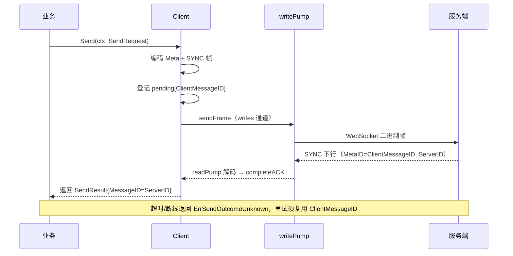
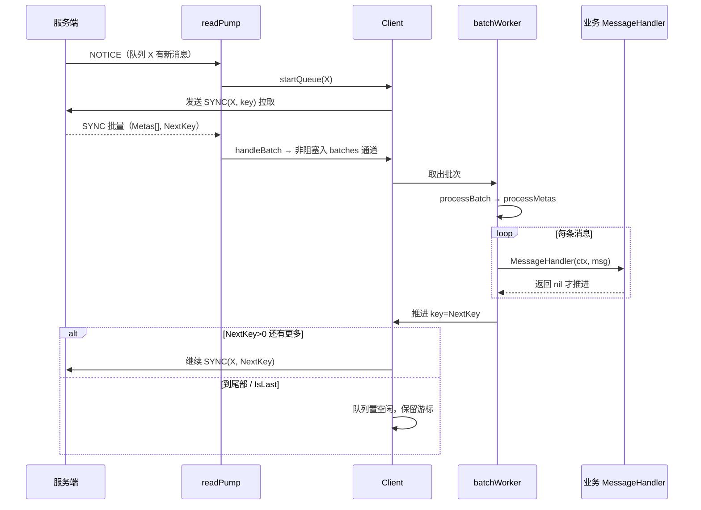

# Go IM SDK

面向客户服务端的环信 IM 长连接 Go SDK。一个 `Client` 同一时刻登录一个 `UserID`，通过安全
WebSocket 保持在线，提供可靠消息收发、公开群 REST 操作和显式用户属性 REST 操作。

> 当前模块路径为 `github.com/easemob/go-im-sdk`。正式发布前请以 release 公告为准。

## 能力与边界

- 登录前必须从 SDK 内置 DNS 引导地址获取 WSS 和 REST 地址；DNS 结果是本次登录的唯一地址来源，失败时不使用配置或缓存降级。
- 仅支持 `wss://` msync 和 `https://` REST，不支持明文 ws/TCP，也不提供跳过 TLS 校验的选项。
- 支持文本、命令、自定义消息，以及单聊、群聊和群定向消息。
- `Send` 等待服务端 ACK；结果不确定时，业务重试必须复用原 `ClientMessageID`。
- 消息 handler 返回 `nil` 后才确认队列进度。handler 应先完成持久化或可靠投递、按 `MetaID` 幂等，并及时响应传入 context。SDK 关闭不会等待忽略 context 的 handler；这类业务 goroutine 及其外部资源由用户负责终止。
- SDK 不存储消息、不维护会话/未读模型，也不消费断线期间积压消息；积压由业务服务通过 REST 拉取。
- 单个 IM 用户同一时刻只能由一个服务实例登录，选主或租约由业务系统负责。

最低 Go 版本为 1.21。目前主要面向 Linux 服务端。

当前 SDK 将预编译的 C++ native codec（包含 protobuf-lite runtime）、C ABI 头文件和目标平台静态库直接放入
同一个 Go Module。用户无需安装 protoc、protobuf，也无需从 OSS 另行下载制品。Linux 构建默认使用
native codec，需要 `CGO_ENABLED=1` 以及可用的 C/C++ 链接工具链；首期目标为
`linux/amd64/glibc` 和 `linux/arm64/glibc`。当前客户部署基线为 glibc 2.28、GCC 8.5.0；客户环境同时提供 Clang 18.1.8，可作为兼容编译器，但最终发布制品必须以不高于 glibc 2.28 的构建环境生成，并检查 `GLIBC_*`/`GLIBCXX_*` 符号版本。
Go Module 通过 cgo 链接目标平台的静态 `.a` 和公开 C ABI header，不要求业务额外集成 framework 或部署 `.so`。
客户构建只使用 native codec；Go generated protobuf、协议源码和内部 C++ 实现不属于客户发布包。
macOS 的 native archive 仅供内部开发验证，使用 `nativecodecdev` build tag；正式发布目标为 Linux amd64/arm64 glibc。

## 安装与作为库使用

```bash
go get github.com/easemob/go-im-sdk/sdk@latest
```

```go
package main

import (
    "context"
    "log"

    imsdk "github.com/easemob/go-im-sdk/sdk"
)

func main() {
    client, err := imsdk.New(imsdk.Config{
        AppKey:   "org#app",
        Resource: loadStableResource(), // 加载已持久化的 UUID 类原始值；SDK 自动加前缀
        MessageHandler: func(ctx context.Context, msg *imsdk.Message) error {
            // 先可靠持久化/投递；返回 nil 后 SDK 才推进队列。
            return persistIdempotently(ctx, msg.MetaID, msg)
        },
        OnConnectionStateChanged: func(userID string, state imsdk.ConnState) {
            log.Printf("IM connection state (%s): %s", userID, state)
        },
        OnDisconnect: func(userID string, err error) { log.Printf("IM disconnected (%s): %v", userID, err) },
        OnTokenExpired: func(userID string) { log.Printf("IM token expired (%s)", userID) },
    })
    if err != nil { log.Fatal(err) }
    defer client.Close(context.Background())
    if err := client.Login(
        context.Background(),
        "server-bot",
        loadTokenFromSecretManager(),
    ); err != nil { log.Fatal(err) }
}
```

`New` 只创建 SDK 实例，`Login(ctx, userID, token)` 才开始 DNS、WSS 和 Provision 登录。
`Login` 只能在未登录状态调用；`Logout` 后可以使用同一 Client 再次登录。`Send` 要求已登录且连接正常，发送方始终是当前登录用户。SDK 版本由库内部维护，业务不配置 `MsyncHost`、`RestBase` 或 `SDKVersion`。

SDK 固定请求 `https://rs.easemob.com/easemob/server.json`，并携带 `sdk_version`、`app_key` 和 `file_version=1`。返回的 `msync-wx.hosts` 和 `rest.hosts` 分别决定 WSS 与 REST 地址；优先选择 `priority=1`，否则使用第一个有效 host。WSS 接受 `wss` 或可转换为 `wss` 的 `https`，REST 只接受 `https`。缺少任一有效地址、HTTP 失败、响应过大或 JSON 无效都会直接使登录失败。

`Resource` 是必填的原始稳定设备身份，首次部署时应生成 UUID 一类具有足够随机性的字符串。业务必须持久化原始值；同一逻辑服务发生宕机、重启或故障转移时必须继续使用原值。更换 Resource 会被服务端视为从另一台设备登录。已经上线的实例即使旧值不是 UUID 格式，也必须继续使用已持久化的旧值，不能为了改格式而替换。SDK 不自动生成或持久化 Resource。SDK 实际使用 `go-server-imsdk-<resource>`；前缀计入最终 128 字符限制，最终值不得包含空白、`/` 或 `@`。

一个 IM 用户只能供一个服务实例在线使用。不要让多个服务实例共享同一用户，也不要同时在其他 Client 或设备登录该用户；后登录的实例或 Client 会导致当前服务连接被踢下线。SDK 目前没有单独的“被踢”回调，业务必须自行保证账号独占，并通过 `OnDisconnect(userID, error)` 和 SDK 错误码观察连接终止。

超时、重试次数、队列大小等调优参数为 SDK 固定常量（不再暴露为 `Config` 配置项）：
心跳间隔 120 秒、心跳超时 240 秒、连接/发送超时 15 秒、登出超时 5 秒、最大帧 4 MiB、
写队列 256、handler 超时 30 秒、重试 3 次、跨队列并发 4、token 提前告警 5 分钟。
代码开源，如需调整请 fork 后自行修改 `sdk/client.go` 中的常量。

所有要使用的 listener 都必须在 `New` 的 `Config` 中传入，登录后不动态补注册，也不补发历史事件。这确保首批同步消息能被初始化时的 `MessageHandler` 接收。生产程序应处理 `OnDisconnect`、`OnTokenWillExpire` 和 `OnTokenExpired`。listener 必须快速返回，不要在回调中执行长时间阻塞任务。
这些业务性断开不会自动重连。登录 token 的申请、刷新和持久化由业务负责；SDK 只维护当前会话的内存 token，业务主动刷新后可调用 `UpdateToken`。

PROVISION 的 `auth_token.expires_in` 会被记录为绝对过期时间（兼容秒/毫秒时间戳及相对秒数）。业务可用
`TokenExpiresAt()` 查询，也可注册 `OnTokenWillExpire` 接收提前告警；默认提前 5 分钟（固定常量，可在 fork 中调整）。

## 生命周期与消息流

### 初始化与登录

```mermaid
flowchart TD
    subgraph 初始化
        A["New(Config)"] --> B["校验 + 补默认值<br/>MessageHandler 必填"]
        B --> C["启动事件分发协程 dispatchEvents"]
        B --> D["启动 HandlerConcurrency 个 batchWorker"]
        C & D --> E["返回 Client（未登录）"]
    end

    subgraph 登录 Login(ctx, userID, token)
        F["校验参数 + 加锁"] --> G["状态 LoggingIn/Connecting<br/>回调 ConnStateConnecting"]
        G --> H["resolveLoginEndpoints<br/>DNS 引导取 WSS/REST 地址"]
        H --> I["connectWithRedirects<br/>WebSocket 拨号，起 readPump/writePump"]
        I --> J["发送 PROVISION 登录帧"]
        J --> K{"PROVISION 响应"}
        K -->|OK| L["acceptProvision 记录 sessionID/token"]
        K -->|REDIRECT| M["跟随重定向，回到拨号"]
        K -->|鉴权/业务错误| N["登录失败返回 error"]
        L --> O["发送首个 UNREAD 保活"]
        O --> P["启动 heartbeat 协程"]
        P --> Q["状态 LoggedIn/Connected<br/>回调 ConnStateConnected"]
        Q --> R["go monitor 开始监控连接"]
    end
```

### 发送消息



### 接收消息



### 心跳与重连

- **心跳**：`heartbeat` 协程每 `HeartbeatInterval`(120s) 发一个空 `UNREAD` 当 ping；收到 `UNREAD` 下行当 pong 并更新 `lastPong`；超过 `HeartbeatTimeout`(240s) 未收到 pong、或 readPump 读超时则断链。
- **网络断线自动重连**：状态切 `Reconnecting`，三段随机退避（5~10s / 20~40s / 60~120s），稳定运行超 5 分钟重置退避档位；重连后队列游标从 0 重新开始，可能重投历史消息，业务需按 `MetaID` 幂等。
- **业务性断开不重连**：被踢出、鉴权失败、token 过期等进入终态，触发 `OnDisconnect`。

## 回调处理

所有 listener 都在 `New` 的 `Config` 中注册，登录后不补注册、不补发历史事件。除 `MessageHandler` 外的回调都跑在**同一个事件分发协程**上，必须快速返回；`MessageHandler` 跑在 `batchWorker` 池上。

| 回调 | 必填 | 触发时机 | 运行线程 |
|---|---|---|---|
| `MessageHandler(ctx, *Message) error` | ✅ | 每条收到的聊天消息（at-least-once） | batchWorker 池 |
| `OnConnectionStateChanged(userID, ConnState)` | — | 连接状态变化 | 事件分发协程 |
| `OnDisconnect(userID, error)` | — | 业务性断开，不会自动重连 | 事件分发协程 |
| `OnTokenExpired(userID)` | — | 登录 token 已过期 | 事件分发协程 |
| `OnTokenWillExpire(userID, time.Time)` | — | token 即将过期（提前告警） | 事件分发协程 |

### MessageHandler（消息处理）

```go
MessageHandler: func(ctx context.Context, msg *imsdk.Message) error {
    // 1. 按 msg.MetaID 幂等持久化/投递，成功后才 return nil
    // 2. 必须尊重 ctx：超时后及时返回，不要忽略 ctx 永久阻塞
    // 3. 返回 error 会重试（最多 HandlerMaxAttempts=3 次，每次 HandlerTimeout=30s）
    return persistIdempotently(ctx, msg.MetaID, msg)
},
```

- 返回 `nil` 后 SDK 才推进队列进度；返回 error 重试后仍失败则**死信该条并继续**，不拆链。
- 投递语义 at-least-once：重连时服务端可能重投同一批次，必须按 `MetaID` 幂等。
- handler 超时未返回会被 `Health().StuckHandlers` 观测；SDK 无法强杀忽略 ctx 的 handler，业务需自行限制阻塞时长并管理外部资源。

### OnConnectionStateChanged

`OnConnectionStateChanged(userID, state)` 在连接状态变化时触发，`userID` 为当前登录用户。`ConnState` 取值：`ConnStateDisconnected` / `ConnStateConnecting` / `ConnStateConnected` / `ConnStateReconnecting`。用于展示在线状态与 ready 判定（通常 `Connected()` 为 true 才报 ready）。

### OnDisconnect

`OnDisconnect(userID, err)` 仅在**业务性断开（不会自动重连）**时触发，`userID` 为断开时的登录用户。通过 `errorCode(err)` 区分原因：

| 错误码 | 含义 | 建议 |
|---|---|---|
| `ErrTokenExpired` / `ErrInvalidToken` | token 过期/无效 | 重新申请 token 后重新 Login |
| `ErrUserForbidden` | 用户被禁用 | 告警 + 业务处理 |
| `ErrBindAnotherDevice` / `ErrTooManyDevices` | 被其他设备/超限挤下线 | 检查账号独占 |
| `ErrResourceChanged` | Resource 变更 | 检查持久化 Resource |
| `ErrAuthentication` / `ErrPermissionDenied` / `ErrAppActiveLimit` / `ErrUserNotFound` | 鉴权/权限/配额 | 告警排查 |
| `ErrKickedChangePass` | 改密被踢 | 重新登录 |

网络类错误（`ErrIO` / `ErrTimeout` / `ErrTLSFailed` / `ErrStreamClosed` / `ErrDNS`）走自动重连，**不会**触发 `OnDisconnect`。`DisableReconnect=true` 时任何断开都会转为 `OnDisconnect`。

### OnTokenExpired / OnTokenWillExpire

- `OnTokenExpired(userID)`：登录后服务端判定 token 已过期，连接进入终态（同时触发 `OnDisconnect`），需重新走 `Login`。
- `OnTokenWillExpire(userID, expiresAt)`：由 PROVISION 的 `expires_in` 计算绝对过期时间，提前 `tokenExpiryWarningBefore`（默认 5 分钟）回调；业务可借此刷新 token 并调用 `UpdateToken`，也可用 `TokenExpiresAt()` 主动查询。

### 回调注意事项

- 除 `MessageHandler` 外的回调都在同一事件分发协程执行，必须快速返回，不要在回调里做阻塞/耗时操作（需要则起独立 goroutine）。
- 事件队列有界，慢回调会导致事件被丢弃（日志会告警），连接状态始终可通过 `Health()` 查询兜底。

## 集成验收 Demo

`cmd/integration-demo` 用于客户环境联调，覆盖 DNS 引导登录、连接状态、session ID、可选测试消息发送与 ACK、消息级 Ext、收到消息回调日志、token 生命周期和可选 REST 用户信息探测。`message_json` 是脱敏视图：保留消息元数据、body 类型和 Ext，不包含文本正文、CMD Params、CustomExts 或原始 payload。日志不输出 token 或 Authorization。

完整的中文命令行测试步骤见 [INTEGRATION_DEMO_README.md](INTEGRATION_DEMO_README.md)。

```bash
go run ./cmd/integration-demo -c prod.yaml
go run ./cmd/integration-demo -c prod.yaml -send-to peer -send-text 'integration test'
go run ./cmd/integration-demo -c prod.yaml -send-to peer \
  -send-text 'with ext' -send-ext 'trace_id=demo-123,payload={"source":"demo"}'
go run ./cmd/integration-demo -c prod.yaml -probe-rest
```

REST 探测失败时，Demo 输出 HTTP status、服务端错误码、耗时和 `request_id`；不会默认打印可重放的完整 curl，避免把 token 写入日志。token 优先从 `GO_IM_SDK_TOKEN` 或 `GO_IM_SDK_TOKEN_FILE` 读取。

## 示例服务部署

示例程序位于 `cmd/server`。它读取一个扁平 YAML 配置，登录后等待 SIGINT/SIGTERM，并在退出时先
执行有超时的 `Logout`，再执行 `Close`。示例 handler 只记录不含消息正文的元数据，部署前应替换为
业务的可靠处理逻辑。

```bash
cd <go-im-sdk-repo>
cp config.example.yaml prod.yaml
chmod 600 prod.yaml
```

编辑 app key、user ID 和需要由业务持久化的原始 resource；WSS、REST 和 SDK 版本不进入配置。token 按以下顺序解析，较高优先级覆盖较低优先级：

1. `GO_IM_SDK_TOKEN` 环境变量；
2. `GO_IM_SDK_TOKEN_FILE` 指向的文件；
3. YAML 的 `token_file`；
4. YAML 的 `token`。

推荐使用 secret file。secret file 必须为当前进程可读且权限是 `0600` 或更严格，并只包含 token
（末尾换行会被去除）。如果把 token 直接放入 YAML，示例程序同样强制 YAML 权限为 `0600` 或更严格。
环境变量可能被编排系统或诊断工具暴露，因此只建议用于有适当隔离的短生命周期环境。日志不会输出 token、
Authorization 或完整消息 payload。

```bash
printf '%s\n' "$IM_TOKEN" > /run/secrets/easemob-token
chmod 600 /run/secrets/easemob-token
export GO_IM_SDK_TOKEN_FILE=/run/secrets/easemob-token

./start.sh -c prod.yaml          # 前台
./start.sh -c prod.yaml -d       # 后台，写 prod.yaml.pid 和 prod.yaml.log
./stop.sh -c prod.yaml           # SIGTERM，等待优雅退出
```

脚本默认按需构建 `bin/go-im-sdk-server`。可通过以下环境变量覆盖部署路径/行为：

- `GO_IM_SDK_BIN`：预构建二进制路径；
- `GO_IM_SDK_PIDFILE`：pidfile 路径；
- `GO_IM_SDK_LOGFILE`：后台日志路径；
- `GO_IM_SDK_STOP_TIMEOUT`：停止等待秒数，默认 15。超时后不会强制 SIGKILL，避免破坏 handler 中的业务事务。

生产中建议由 systemd、Kubernetes 等进程管理器以前台方式运行二进制，并将 token 作为 secret file 挂载。
启动脚本的后台模式用于简单部署，不提供崩溃自动拉起。

示例配置解析器有意只接受 `config.example.yaml` 展示的顶层 `key: scalar` 子集，并拒绝未知键、重复键、
数组和对象。SDK 库本身不读配置文件；复杂配置应由业务程序使用其既有配置系统组装 `sdk.Config`。

## 发送消息与 REST API

```go
result, err := client.Send(ctx, imsdk.SendRequest{
    ClientMessageID: businessStableID, // 可省略；重试时必须复用
    To: "user-b",
    Ext: map[string]imsdk.KeyValue{
        "trace_id": {Type: imsdk.KeyValueString, Value: "request-123"},
        "payload": {
            Type:  imsdk.KeyValueJSONString,
            Value: `{"order_id":"123"}`,
        },
    },
    Body: imsdk.MessageBody{Type: imsdk.MessageBodyText, Text: "hello"},
})
```

发送成功后，`result.MessageID` 是 ACK 返回的最终服务器消息 ID；`result.ClientMessageID` 只是本地关联和结果不确定重试使用的 ID。接收端同一条消息的 `Message.MetaID` 与 `result.MessageID` 一致。兼容字段 `result.ServerMessageID` 与 `MessageID` 值相同，新代码应使用 `MessageID`。

发送端的 `SendRequest.Ext` 对应接收端的 `Message.Ext`，支持 `KeyValueBool`、`KeyValueInt`、`KeyValueUint`、`KeyValueLong`、`KeyValueFloat`、`KeyValueDouble`、`KeyValueString` 和 `KeyValueJSONString`。SDK 按 key 稳定排序编码；`nil` 或空 map 不会在 wire 上携带 Ext。`Body.Params` 仅属于 CMD body，`Body.CustomExts` 仅属于 Custom body，二者都不是消息级 Ext，发送时仍只支持 `KeyValueString` 和 `KeyValueJSONString`。

群聊设置 `IsGroup: true`；群定向消息同时填写 `DirectedUsers`。创建公开群、加入公开群、退出群，以及
`UpdateOwnUserInfo`、`FetchUserInfo` 都使用本次 Login 的 DNS 结果、当前用户和 token。非 2xx 响应会返回
`*sdk.APIError`，其中保留受限大小的 `Response`、服务错误码、request ID 和 `RetryAfter`。对创建/加入等
结果不确定的写操作，SDK 不自动重试。

集成 demo 也提供了这些 REST 操作的命令行示例（响应 body 会写入同一个日志）：

```bash
# 设置当前用户属性；多个属性用逗号分隔
go run ./cmd/integration-demo -c prod.yaml \
  -set-user 'nickname=Go Demo,department=IM'

# 获取用户属性；-fetch-properties 可省略以获取服务端返回的默认属性
go run ./cmd/integration-demo -c prod.yaml \
  -fetch-users 'lxm,lxm2' -fetch-properties 'nickname,department'

# 创建公开群；从 rest.create_group_succeeded 的 body 中取得 group ID
go run ./cmd/integration-demo -c prod.yaml \
  -create-group 'go-sdk-test-group' -group-members 'lxm2'

# 使用上一步的 group ID 加入或退出
go run ./cmd/integration-demo -c prod.yaml -join-group GROUP_ID
go run ./cmd/integration-demo -c prod.yaml -leave-group GROUP_ID
```

这些操作可以与 `-debug`、`-send-to` 一起使用；REST 和 WSS 日志会共用同一个 `slog.Logger` 输出。

## 可观测性与健康检查

可通过 `Config.Logger` 注入 `*slog.Logger`，通过 `Config.Telemetry` 接收脱敏事件。`Client.Health()` 提供
连接 generation、最近入站时间、写/队列 backlog 和最近错误，可用于健康检查；通常 `Connected()` 为 true
才应报告 ready。回调、日志和 telemetry 不应执行耗时业务逻辑。

## 构建与验证

```bash
go test ./...
go test -race ./...
go vet ./...
go build ./cmd/server

# macOS Apple Silicon 开发用 native codec 回归
CGO_ENABLED=1 GOARCH=arm64 go test -tags nativecodecdev ./...
```

测试应保持离线，不依赖真实环信后端。部署前至少验证 TLS 证书链、secret 权限、SIGTERM 优雅退出和
handler 的幂等存储语义。

### 发布制品门禁

正式 native release 必须从发布候选目录运行：

```bash
cp native/manifest.json.example native/manifest.json
# 填写真实版本、制品路径与 SHA-256 后：
RELEASE_DIR=/path/to/release-candidate ./scripts/verify-release.sh
```

脚本校验 manifest、发布 allowlist、协议/实现源码泄漏、module 压缩与解压体积，并执行当前 Go 测试。
发布包不得包含 `.proto`、`.pb.go`、`.pb.cc`、`.pb.h` 或私有 C++ 实现源码。开发树在迁移期间仍保留
这些文件，门禁只在 `RELEASE_DIR` 指向最终客户发布候选目录时将其视为错误。默认 module zip 上限为
50 MiB、解压上限为 200 MiB，可由 `MAX_ZIP_BYTES` 和 `MAX_UNZIPPED_BYTES` 在发布 CI 中收紧。

protobuf-lite 是 SDK 内部静态依赖，不是用户安装依赖；实际版本、来源和许可证必须记录在
`THIRD_PARTY_NOTICES` 与 SBOM 中。产品说明使用“用环信 Go IM SDK 的 protobuf 编解码库”。

## 安全注意事项

- 不要把 token、生产配置、pidfile 或日志提交到版本库。
- 不要在 handler、日志或 telemetry 中记录 Authorization、token 或完整消息正文。
- 由业务定期刷新并安全持久化 token，实现 token 将过期/已过期回调；业务性禁用或踢出应由上层告警和人工/业务策略恢复。
- redirect 由 SDK 限制为安全 endpoint，不要在外围将其转换为明文连接。
- 对收到的消息内容按不可信输入处理；转发到数据库、模板、shell 或其他系统前执行相应转义和校验。
